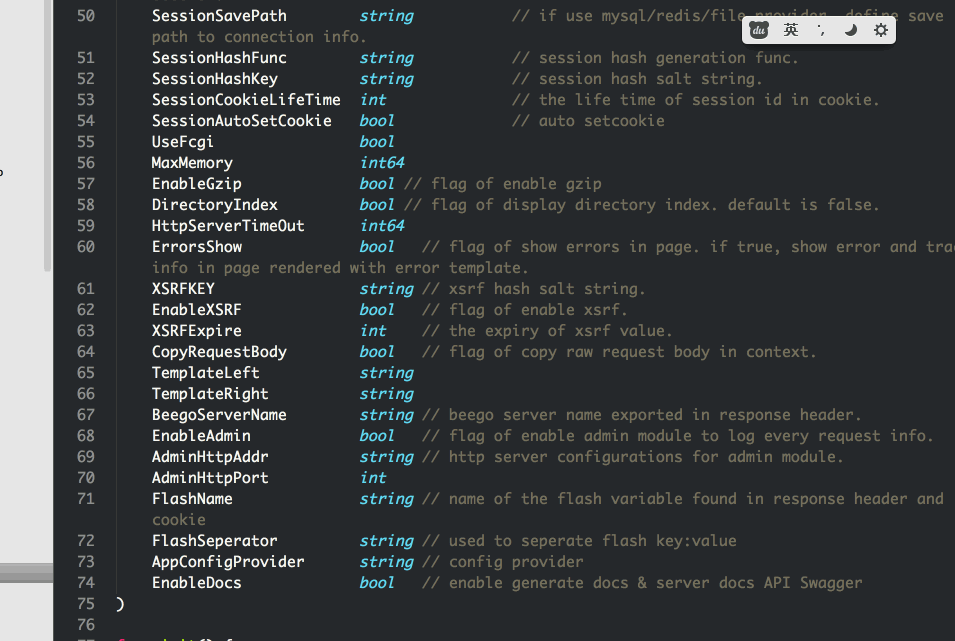

## AceJump
------------------------

Plugin for Sublime Text 2/3, inspired by emacs AceJump.

 

## How to use it
--------------------------

- Default short cut key is `ctlr+;`( `super + ;` in mac).

- When you in Ace-jump mod , input the first letter of the word you want to jump, and it will show some colorful letter-tips( less than 2 characters), just input the tips and Enter, it will jump there... 

 

How to install
--------------

- Git clone this project, put AceJump folder to Packages directory of ST2/3
(Preferences > Browse Packages)

 

